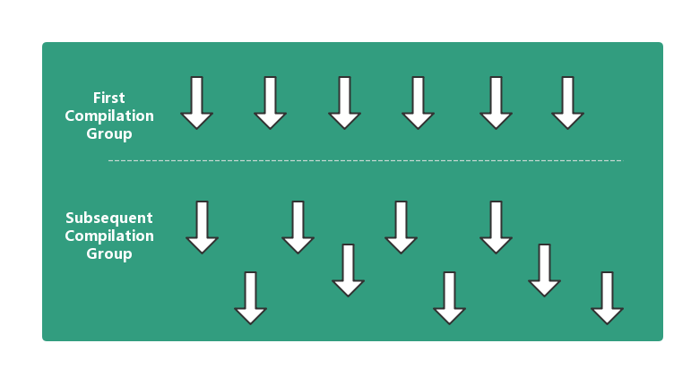
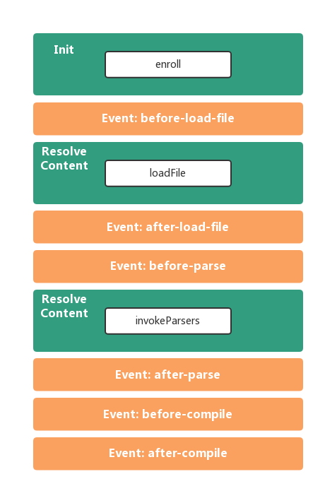

# CLI如何工作

CLI 由主要由 `Compiler`、`Compilation`、`Parser`、`Plugin` 组成，其的核心是 `Compiler`, 用于管理分散在各处的 `Compilation`。

启动时，CLI 会获取 `src` 下的所有文件，并为每个文件创建唯一的编译任务（`Compilation`）。这些 `Compilation` 会被放到 `First Compilation Group` 中，当所有任务执行完后，CLI 宣布启动成功，并开始监听文件变化，为后续的每次文件变更创建 `Compilation`。

`Compilation` 的工作流程如下图:

橙色部分会触发对应的钩子，如果有 `Plugin` 在此阶段注册了相应的事件处理，那么它们会被顺序执行，直到所有注册的 `Plugin` 被调用后才进行下一个环节。

> `Parser` 工作在 `Resolve Content` 环节。
> 内置的依赖处理插件被挂到了 `before-compile` 节点。
